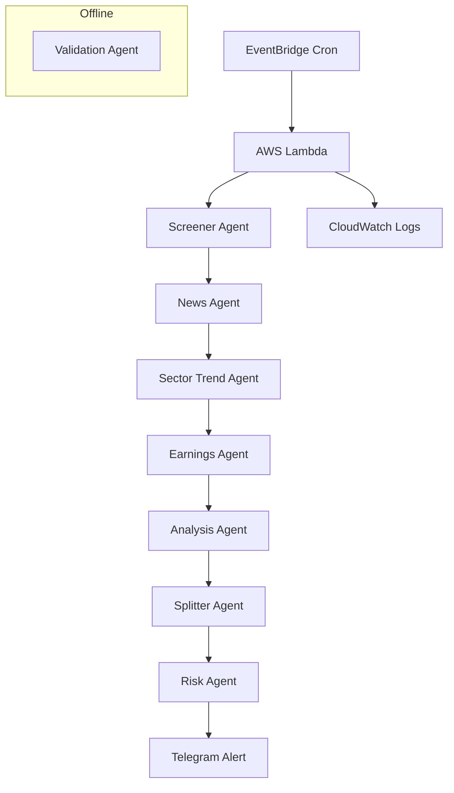

# alphascout

alphascout is a rule-first, AI-assisted investment research and SIP orchestration system for long-term equity investing in Indian markets.
- [alphascout](#alphascout)
  - [Core Philosophy](#core-philosophy)
  - [System Overview](#system-overview)
  - [Architecture](#architecture)
  - [Design Diagram](#design-diagram)
  - [Agent Responsibilities](#agent-responsibilities)
    - [Screener Agent](#screener-agent)
    - [News Agent](#news-agent)
    - [Sector Trend Agent](#sector-trend-agent)
    - [Earnings \& Guidance Agent](#earnings--guidance-agent)
    - [Analysis Agent](#analysis-agent)
    - [Splitter Agent](#splitter-agent)
    - [Risk Agent](#risk-agent)
    - [Alert Agent](#alert-agent)
    - [Validation Agent](#validation-agent)
  - [Screening \& Decision Logic](#screening--decision-logic)
  - [Capital Allocation](#capital-allocation)
  - [Risk Management](#risk-management)
  - [Notifications](#notifications)
  - [Validation \& Backtesting](#validation--backtesting)
  - [Infrastructure](#infrastructure)
  - [Design Principles](#design-principles)
  - [What This Project Is Not](#what-this-project-is-not)
  - [Disclaimer](#disclaimer)

alphascout is intended to support human judgment, not replace it.

## Core Philosophy

alphascout is built on a few non-negotiable principles:

- Rules before narratives

- Risk before returns

- AI assists, never overrides fundamentals

- Explainability over optimization

- Validation before evolution

The system explicitly avoids curve fitting, short-term prediction, and black-box behavior.

## System Overview

alphascout runs as a scheduled pipeline that:

1. Screens fundamentally strong stocks trading below recent highs

2. Incorporates sector trends and earnings signals in a controlled manner

3. Allocates small monthly SIP capital intelligently

4. Enforces strict stock- and sector-level risk limits

5. Sends only actionable, explainable alerts via Telegram

All intelligence runs in Python; infrastructure is serverless and minimal.

## Architecture

```java
EventBridge (Cron)
      ↓
AWS Lambda (CrewAI Pipeline)
      ↓
CloudWatch Logs
      ↓
Telegram Alerts

Offline / Periodic:
Validation & Backtesting Agent
```
The system is designed to run comfortably within AWS Free Tier.

## Design Diagram



## Agent Responsibilities

### Screener Agent

- Applies deterministic “fallen-angel” quality filters
- Ensures financial survivability and liquidity
- Ignores news and sentiment

### News Agent

- Extracts structured macro and sector signals
- Produces facts, not opinions

### Sector Trend Agent
- Converts news into numeric sector strength scores (0–100)
- Applies time-decay to prevent stale narratives
- Adjusts thresholds, never risk rules

### Earnings & Guidance Agent
- Scores earnings surprises and guidance changes
- Influences conviction only (limited weight)

### Analysis Agent

Combines:
  - Fundamental quality
  - Sector-relative ranking
  - Sector strength
  - Earnings adjustment

Produces a ranked candidate list.

### Splitter Agent

- Allocates ₹1000–₹2000 monthly SIPs
- Confidence-weighted
- Enforces minimum ticket sizes

### Risk Agent
- Enforces stock and sector exposure limits
- Applies trailing stop-loss rules
- Has absolute veto authority

### Alert Agent

- Sends clear, explainable Telegram alerts
- Avoids noise and repetition

### Validation Agent

- Replays historical data
- Measures robustness, drawdowns, and signal contribution
- Produces diagnostics, not trading decisions

## Screening & Decision Logic

Typical baseline filters include (configurable):
  - ROCE (3Y) > 18%
  - ROE > 15%
  - Sales Growth (3Y) > 15%
  - Operating Profit Growth (3Y) > 12%
  - Debt/Equity < 0.7
  - Interest Coverage > 3
  - Adequate liquidity
  - Price meaningfully below 52-week high

Sector strength may relax growth thresholds, but never risk rules.

## Capital Allocation

- Monthly SIP only (₹1000–₹2000)
- Fewer, higher-conviction positions
- No averaging into broken fundamentals
- No rebalancing churn

## Risk Management
Hard constraints include:
  - Max stock exposure
  - Max sector exposure
  - Trailing stop-loss
  - Fundamental deterioration checks

Risk controls override all other agents.

## Notifications

alphascout is intentionally quiet.

You are notified only when:
  - A monthly SIP decision is ready
  - A meaningful earnings impact occurs
  - A risk rule is breached
  - A sector regime meaningfully changes

No alerts for routine news, minor rank changes, or internal diagnostics.

## Validation & Backtesting

Validation is treated as a first-class concern.

The system:
  - Replays historical data using the same agents and rules
  - Measures hit-rate vs benchmarks
  - Tracks drawdowns and volatility
  - Evaluates incremental value of each agent layer

Results are used to adjust configurations, not to optimize returns.

## Infrastructure
- Runtime: AWS Lambda (Python)
- Scheduling: EventBridge
- Logs: CloudWatch Logs
- Secrets: Lambda environment variables (v1)
- Alerts: Telegram Bot API

Designed to run at near-zero cost on AWS Free Tier.

Repository Structure

```sh
alphascout/
├── lambda_handler.py
├── agents/
├── tasks/
├── services/
├── core/
├── config/
└── validation/
```

Clear separation between:
  - Business logic
  - Agent orchestration
  - Infrastructure
  - External services

## Design Principles
  - Single responsibility per module
  - Fail-fast configuration
  - Deterministic defaults
  - Extensible agent pipeline
  - Infrastructure-agnostic logic

## What This Project Is Not

alphascout is not:
  - A stock tip generator
  - A trading bot
  - A prediction engine
  - A black-box AI system
  - A substitute for human judgment

## Disclaimer

This project is for educational and research purposes only.
It does not constitute financial advice, investment recommendations, or solicitation.

All investment decisions and outcomes remain the sole responsibility of the user.